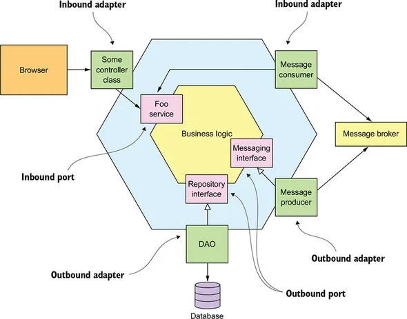

# Ports And Adapters Architecture ou Arquitetura Hexagonal

 

## Arquitetura

## Fundamentos teóricos

> Ports & Adapters Architecture ou Arquitetura Hexagonal: A arquitetura hexagonal, ou arquitetura de portas e adaptadores, é um padrão arquitetural usado no design de software. O objetivo é criar componentes de aplicativos fracamente acoplados que possam ser facilmente conectados ao ambiente de software por meio de portas e adaptadores. Como define seu criador Alistair Cockburn ["Allow an application to equally be driven by users, programs, automated test or batch scripts, and to be developed and tested in isolation from its eventual run-time devices and databases."](https://alistair.cockburn.us/hexagonal-architecture/)

> Springboot: O Spring Boot é um projeto da Spring que veio para facilitar o processo de configuração e publicação de nossas aplicações. A intenção é ter o seu projeto rodando o mais rápido possível e sem complicação.

> Java: Java é uma linguagem de programação orientada a objetos desenvolvida na década de 90 por uma equipe de programadores chefiada por James Gosling, na empresa Sun Microsystems. Em 2008 o Java foi adquirido pela empresa Oracle Corporation.

## Tecnologias
- Java 17
- Spring Boot 2.7.10
    - spring-boot-starter-web
    - spring-boot-starter-data-jpa
    - spring-boot-devtools
- Flywaydb
- Lombok
- Mysql
- springdoc-openapi-ui
- Tomcat (Embedded no Spring Boot)
- Git